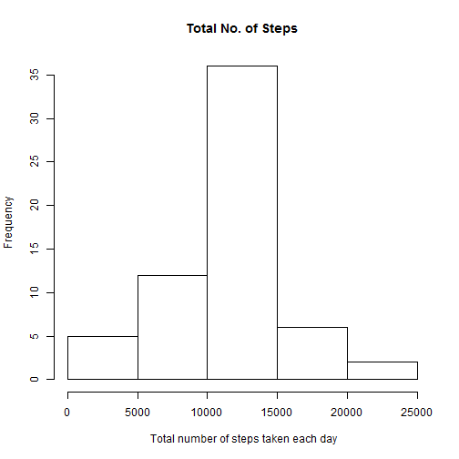

## Loading and preprocessing the data
##Part 1 of assignment

Read input file into a dataframe ignoring NAs and handling factors


```r
library(dplyr)
data <- read.csv("activity.csv", stringsAsFactors=T)
complete<-na.omit(data)
```


## What is mean total number of steps taken per day?

Perpare the sum, mean, and median


```r
daily<-group_by(complete,date) 
(per_day   <- summarise(daily, Sum= sum(steps),Mean=mean(steps), Median=median(steps)))
```

```
## Source: local data frame [53 x 4]
## 
##          date   Sum       Mean Median
## 1  2012-10-02   126  0.4375000      0
## 2  2012-10-03 11352 39.4166667      0
## 3  2012-10-04 12116 42.0694444      0
## 4  2012-10-05 13294 46.1597222      0
## 5  2012-10-06 15420 53.5416667      0
## 6  2012-10-07 11015 38.2465278      0
## 7  2012-10-09 12811 44.4826389      0
## 8  2012-10-10  9900 34.3750000      0
## 9  2012-10-11 10304 35.7777778      0
## 10 2012-10-12 17382 60.3541667      0
## 11 2012-10-13 12426 43.1458333      0
## 12 2012-10-14 15098 52.4236111      0
## 13 2012-10-15 10139 35.2048611      0
## 14 2012-10-16 15084 52.3750000      0
## 15 2012-10-17 13452 46.7083333      0
## 16 2012-10-18 10056 34.9166667      0
## 17 2012-10-19 11829 41.0729167      0
## 18 2012-10-20 10395 36.0937500      0
## 19 2012-10-21  8821 30.6284722      0
## 20 2012-10-22 13460 46.7361111      0
## 21 2012-10-23  8918 30.9652778      0
## 22 2012-10-24  8355 29.0104167      0
## 23 2012-10-25  2492  8.6527778      0
## 24 2012-10-26  6778 23.5347222      0
## 25 2012-10-27 10119 35.1354167      0
## 26 2012-10-28 11458 39.7847222      0
## 27 2012-10-29  5018 17.4236111      0
## 28 2012-10-30  9819 34.0937500      0
## 29 2012-10-31 15414 53.5208333      0
## 30 2012-11-02 10600 36.8055556      0
## 31 2012-11-03 10571 36.7048611      0
## 32 2012-11-05 10439 36.2465278      0
## 33 2012-11-06  8334 28.9375000      0
## 34 2012-11-07 12883 44.7326389      0
## 35 2012-11-08  3219 11.1770833      0
## 36 2012-11-11 12608 43.7777778      0
## 37 2012-11-12 10765 37.3784722      0
## 38 2012-11-13  7336 25.4722222      0
## 39 2012-11-15    41  0.1423611      0
## 40 2012-11-16  5441 18.8923611      0
## 41 2012-11-17 14339 49.7881944      0
## 42 2012-11-18 15110 52.4652778      0
## 43 2012-11-19  8841 30.6979167      0
## 44 2012-11-20  4472 15.5277778      0
## 45 2012-11-21 12787 44.3993056      0
## 46 2012-11-22 20427 70.9270833      0
## 47 2012-11-23 21194 73.5902778      0
## 48 2012-11-24 14478 50.2708333      0
## 49 2012-11-25 11834 41.0902778      0
## 50 2012-11-26 11162 38.7569444      0
## 51 2012-11-27 13646 47.3819444      0
## 52 2012-11-28 10183 35.3576389      0
## 53 2012-11-29  7047 24.4687500      0
```


## What is the average daily activity pattern?

Draw the histogram for the sum


```r
hist(per_day$Sum)
```

 

##Part 2 of assignment

Prepare the data to get the average for the 5 min interval

```r
interval<-group_by(complete,interval) 
(grouped_interval   <- summarise(interval, Average= mean(steps)))
```

```
## Source: local data frame [288 x 2]
## 
##    interval   Average
## 1         0 1.7169811
## 2         5 0.3396226
## 3        10 0.1320755
## 4        15 0.1509434
## 5        20 0.0754717
## 6        25 2.0943396
## 7        30 0.5283019
## 8        35 0.8679245
## 9        40 0.0000000
## 10       45 1.4716981
## ..      ...       ...
```

Plot the average


```r
plot(grouped_interval$Average~grouped_interval$interval,type="l",ylab="Average Steps", xlab=" 5-minute interval",main="Average Interval Steps")
```

 

Finding the interval with maximum average


```r
Max_Int<-max(grouped_interval$Average)
grouped_interval[ which(grouped_interval$Average==Max_Int),1]
```

```
## [1] 835
```

## Imputing missing values
##Part 3 of assignment

Compute the number of NA rows

```r
sub<-subset(data,is.na(data$steps)==TRUE)
dim(sub)[1]
```

```
## [1] 2304
```

Filling the missing data using the mean for the interval
Make a copy of original data so as not to loose it !!

```r
data1<-data

interval2<-group_by(data1,interval) 
(grouped_interval2   <- summarise(interval2, 
                                  Average= mean(steps,na.rm=TRUE)))
```

```
## Source: local data frame [288 x 2]
## 
##    interval   Average
## 1         0 1.7169811
## 2         5 0.3396226
## 3        10 0.1320755
## 4        15 0.1509434
## 5        20 0.0754717
## 6        25 2.0943396
## 7        30 0.5283019
## 8        35 0.8679245
## 9        40 0.0000000
## 10       45 1.4716981
## ..      ...       ...
```

```r
index<-which(is.na(data1)==TRUE)
for(i in 1:length(index))
        {
        inter1<-data1[index[i],3]
        new_steps<-grouped_interval2[which(grouped_interval2[1]
                                           == inter1),2]                                  
        data1[index[i],1]=ceiling(new_steps)
        }
## display the first 20 rows of the new dataset without NAs

head(data1,20)
```

```
##    steps       date interval
## 1      2 2012-10-01        0
## 2      1 2012-10-01        5
## 3      1 2012-10-01       10
## 4      1 2012-10-01       15
## 5      1 2012-10-01       20
## 6      3 2012-10-01       25
## 7      1 2012-10-01       30
## 8      1 2012-10-01       35
## 9      0 2012-10-01       40
## 10     2 2012-10-01       45
## 11     1 2012-10-01       50
## 12     1 2012-10-01       55
## 13     1 2012-10-01      100
## 14     1 2012-10-01      105
## 15     1 2012-10-01      110
## 16     1 2012-10-01      115
## 17     0 2012-10-01      120
## 18     2 2012-10-01      125
## 19     2 2012-10-01      130
## 20     1 2012-10-01      135
```

Calcualte the new sum, mean, and median of the new dataset and draw the histogram

Perpare the sum, mean, and median


```r
daily2<-group_by(data1,date) 
(per_day2   <- summarise(daily2, Sum= sum(steps),Mean=mean(steps), Median=median(steps)))
```

```
## Source: local data frame [61 x 4]
## 
##          date   Sum       Mean Median
## 1  2012-10-01 10909 37.8784722   34.5
## 2  2012-10-02   126  0.4375000    0.0
## 3  2012-10-03 11352 39.4166667    0.0
## 4  2012-10-04 12116 42.0694444    0.0
## 5  2012-10-05 13294 46.1597222    0.0
## 6  2012-10-06 15420 53.5416667    0.0
## 7  2012-10-07 11015 38.2465278    0.0
## 8  2012-10-08 10909 37.8784722   34.5
## 9  2012-10-09 12811 44.4826389    0.0
## 10 2012-10-10  9900 34.3750000    0.0
## 11 2012-10-11 10304 35.7777778    0.0
## 12 2012-10-12 17382 60.3541667    0.0
## 13 2012-10-13 12426 43.1458333    0.0
## 14 2012-10-14 15098 52.4236111    0.0
## 15 2012-10-15 10139 35.2048611    0.0
## 16 2012-10-16 15084 52.3750000    0.0
## 17 2012-10-17 13452 46.7083333    0.0
## 18 2012-10-18 10056 34.9166667    0.0
## 19 2012-10-19 11829 41.0729167    0.0
## 20 2012-10-20 10395 36.0937500    0.0
## 21 2012-10-21  8821 30.6284722    0.0
## 22 2012-10-22 13460 46.7361111    0.0
## 23 2012-10-23  8918 30.9652778    0.0
## 24 2012-10-24  8355 29.0104167    0.0
## 25 2012-10-25  2492  8.6527778    0.0
## 26 2012-10-26  6778 23.5347222    0.0
## 27 2012-10-27 10119 35.1354167    0.0
## 28 2012-10-28 11458 39.7847222    0.0
## 29 2012-10-29  5018 17.4236111    0.0
## 30 2012-10-30  9819 34.0937500    0.0
## 31 2012-10-31 15414 53.5208333    0.0
## 32 2012-11-01 10909 37.8784722   34.5
## 33 2012-11-02 10600 36.8055556    0.0
## 34 2012-11-03 10571 36.7048611    0.0
## 35 2012-11-04 10909 37.8784722   34.5
## 36 2012-11-05 10439 36.2465278    0.0
## 37 2012-11-06  8334 28.9375000    0.0
## 38 2012-11-07 12883 44.7326389    0.0
## 39 2012-11-08  3219 11.1770833    0.0
## 40 2012-11-09 10909 37.8784722   34.5
## 41 2012-11-10 10909 37.8784722   34.5
## 42 2012-11-11 12608 43.7777778    0.0
## 43 2012-11-12 10765 37.3784722    0.0
## 44 2012-11-13  7336 25.4722222    0.0
## 45 2012-11-14 10909 37.8784722   34.5
## 46 2012-11-15    41  0.1423611    0.0
## 47 2012-11-16  5441 18.8923611    0.0
## 48 2012-11-17 14339 49.7881944    0.0
## 49 2012-11-18 15110 52.4652778    0.0
## 50 2012-11-19  8841 30.6979167    0.0
## 51 2012-11-20  4472 15.5277778    0.0
## 52 2012-11-21 12787 44.3993056    0.0
## 53 2012-11-22 20427 70.9270833    0.0
## 54 2012-11-23 21194 73.5902778    0.0
## 55 2012-11-24 14478 50.2708333    0.0
## 56 2012-11-25 11834 41.0902778    0.0
## 57 2012-11-26 11162 38.7569444    0.0
## 58 2012-11-27 13646 47.3819444    0.0
## 59 2012-11-28 10183 35.3576389    0.0
## 60 2012-11-29  7047 24.4687500    0.0
## 61 2012-11-30 10909 37.8784722   34.5
```

Draw the histogram for the sum


```r
hist(per_day2$Sum,xlab=" Total number of steps taken each day", main="Total No. of Steps")
```

 

compare results before and after adding missing data

```r
#par(mfrow=c(2,1))

v1<-as.numeric(per_day$Mean)
v2<-as.numeric(per_day$Median)
v3<-as.numeric(per_day2$Mean)
v4<-as.numeric(per_day2$Median)

plot_colors <- c("black","red")

plot(v1, type="l", col=plot_colors[1], xaxt = "n",ylab="",xlab="")
lines(v3, type="l", col=plot_colors[2])

title(ylab= "Average Steps")
title(xlab="Day")
axis(1,at=1:53,labels=per_day$date)

legend("topleft",legend=(c("Mean Without NAs","Mean with NAs")), 
       col=plot_colors,pch = c(1,2), lty = c(1,2)) 
```

 

```r
# gives the legend lines the correct color and width


plot(v2, type="l", col=plot_colors[1], xaxt = "n",ylab="",xlab="")
lines(v4, type="l", col=plot_colors[2])

title(ylab= "Median step value")
title(xlab="Day ")
axis(1,at=1:53,labels=per_day$date)

legend("bottomleft",legend=(c("Median Without NAs","Median with NAs")),col=plot_colors,pch = c(1,2), lty = c(1,2)) 
```

 

```r
# gives the legend lines the correct color and width
```
Effect of adding missing values on total number of daily steps

```r
v5<-as.numeric(per_day$Sum)
v6<-as.numeric(per_day2$Sum)

plot_colors <- c("black","red")

plot(v5, type="l", col=plot_colors[1], xaxt = "n",ylab="",xlab="")
lines(v6, type="l", col=plot_colors[2])

title(ylab= "Total Steps")
title(xlab="Day")
axis(1,at=1:53,labels=per_day$date)

legend("topleft",legend=(c("Sum Without NAs","Sum with NAs")), col=plot_colors,pch = c(1,2), lty = c(1,2)) # gives the legend lines the correct color and width
```

 


## Are there differences in activity patterns between weekdays and weekends?

```r
library(timeDate)
library(dplyr)

wend<-NULL
for(i in 1:dim(data1)[1])
        {
        wend[i]<-isWeekend(data1[i,2])
        }
data2<-cbind(data1,wend)

inter3<-subset(data2,data2$wend=="FALSE")
group1<-group_by(inter3,interval) 
(weekday_avg  <- summarise(group1,Mean=mean(steps)))
```

```
## Source: local data frame [288 x 2]
## 
##    interval      Mean
## 1         0 2.2888889
## 2         5 0.5333333
## 3        10 0.2888889
## 4        15 0.3111111
## 5        20 0.2222222
## 6        25 1.7111111
## 7        30 0.7555556
## 8        35 1.1555556
## 9        40 0.0000000
## 10       45 1.8666667
## ..      ...       ...
```

```r
inter4<-subset(data2,data2$wend=="TRUE")
group2<-group_by(inter4,interval) 
(weekend_avg  <- summarise(group2,Mean=mean(steps)))
```

```
## Source: local data frame [288 x 2]
## 
##    interval  Mean
## 1         0 0.250
## 2         5 0.125
## 3        10 0.125
## 4        15 0.125
## 5        20 0.125
## 6        25 3.625
## 7        30 0.125
## 8        35 0.125
## 9        40 0.000
## 10       45 0.625
## ..      ...   ...
```

```r
# plot_colors <- c("black","red")
# 
# plot(weekday_avg$Mean, type="l", col=plot_colors[1], xaxt = "n",ylab="",xlab="")
# lines(weekend_avg$Mean, type="l", col=plot_colors[2])
# 
# title(ylab= "Average Steps")
# title(xlab="Interval")
# axis(1,at=1:288,labels=weekday_avg$interval)
# 
# legend("topleft",legend=(c("Weekday Average","Weekend Average")), col=plot_colors,pch = c(1,2), lty = c(1,2))

library(ggplot2)
require(gridExtra)


p1<-ggplot(data=weekend_avg, aes(x=weekend_avg$interval, y=weekend_avg$Mean, group=1)) + 
  geom_line(size=1) + 
  xlab("5-minute interval") +
  ylab("Average Steps") +
  ggtitle("Weekday Mean Steps")

p2<-ggplot(data=weekday_avg, aes(x=weekday_avg$interval, y=weekday_avg$Mean, group=1)) + 
  geom_line(size=1) + 
    xlab("5-minute interval") +
  ylab("Average Steps") +
  ggtitle("Weekend Mean Steps")
grid.arrange(p1, p2, nrow=2)
```

 
